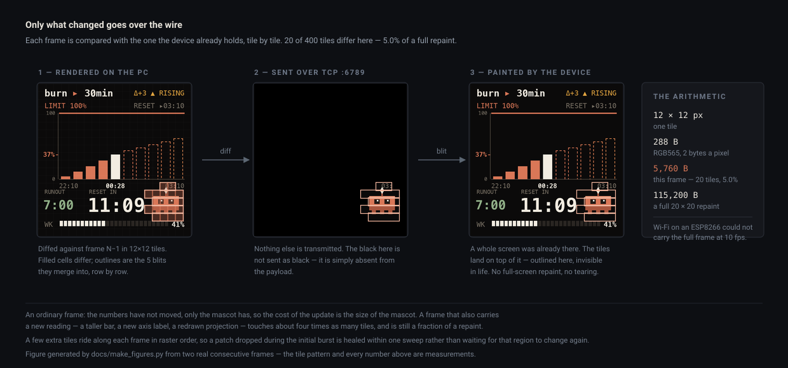

<h1 align="center">
  <br>
  SmallTV-Ultra
</h1>

<p align="center">
  <b>Custom ESPHome firmware for the GeekMagic SmallTV-Ultra — and a 240×240 desk display<br>
  that shows how much of your Claude Code and OpenAI Codex usage limit is left.</b>
</p>

<p align="center">
  
  
  
  
  
</p>

<p align="center">
  
</p>

<p align="center">
  <sub><b>77% of the five-hour window gone; the projection says seven minutes left.</b>
  Glanceable from across the desk — which is the entire point.</sub>
</p>

The stock GeekMagic firmware gives you a clock, the weather, and no say in the matter.
This replaces it with [ESPHome](https://esphome.io), then adds the part that makes the
little screen worth having: a **PC-side renderer** that draws a 240×240 frame and streams
only the changed tiles to the device over TCP.

That split is deliberate. The ESP8266 has about 12 KB of free heap, so it keeps a lean set
of **local pages** and still shows something useful with the PC off — while anything rich
(real fonts, Korean text, smooth animation, live API data) is drawn on the PC, where there
is memory to do it. Adding a screen costs the device nothing.

The screens it was built for are **usage monitors for Claude Code and Codex**. Not a
percentage: the shape of the five-hour window filling up, and an honest projection of when
it runs out.

## Screens

<table>
  <tr>
    <td width="230" align="center"></td>
    <td><b>Claude Code usage</b> — a burn histogram of the five-hour rate-limit window. Solid bars are measured, dashed bars are the projection, warming toward red as they approach the limit. Below, two deadlines race each other: <b>RUNOUT</b> (when the current burn rate reaches 100%) against <b>RESET IN</b>. The weekly limit runs along the bottom. Reads the claude.ai limits API.</td>
  </tr>
  <tr>
    <td width="230" align="center"></td>
    <td><b>Codex usage</b> — the same screen in teal, with a pixel-art terminal in the mascot box. Reads ChatGPT's own Codex usage API, so it reports your <i>account</i>: the machine running Codex does not have to be this one. A third source alternates the two on one connection.</td>
  </tr>
  <tr>
    <td width="230" align="center"></td>
    <td><b>Stocks</b> — candlesticks with moving averages, Bollinger bands, volume and RSI, cycling through a ticker list you set in the panel. Yahoo symbols, so KOSPI and crypto work too (<code>005930.KS</code>, <code>BTC-USD</code>).</td>
  </tr>
  <tr>
    <td width="230" align="center"></td>
    <td><b>S&amp;P sectors</b> — the eleven SPDR sector ETFs plus SPY as a heatmap, with market breadth in the header. One glance tells you whether it was a broad day or one sector carrying it.</td>
  </tr>
  <tr>
    <td width="230" align="center"></td>
    <td><b>CPU furnace</b> — your machine's load as a fire that grows and whitens as it climbs. Useless, and the first thing anyone asks about.</td>
  </tr>
</table>

Also: GIF slideshows, video playback (needs `ffmpeg`), and the device's own local pages —
clock and weather — which run on the ESP8266 itself.

## How it works

<p align="center">
  
</p>

- **The curve is observed, not reconstructed.** Both APIs report one number — "you are N%
  through this window" — and nothing about how you got there. Every reading is appended to
  a per-window history file, so a past bar is a recorded fact and is never redrawn.
- **Only changed tiles go over the wire.** Each frame is diffed into 12×12 cells against
  what the device already has — see below. In practice that runs at about 9.5 fps and
  40–60 KB/s.
- **A stream client owns the screen while it is connected.** Disconnect it and the device
  is back on its own clock a few seconds later — no PC, still a working display.

<p align="center">
  
</p>

An ordinary frame moves the mascot and nothing else, so **20 of 400 tiles change — 5,760
bytes against 115,200 for a full repaint**. The device is on Wi-Fi with about 12 KB of
heap; it could not take a full frame ten times a second, and it never has to. The figure
is generated by [`docs/make_figures.py`](docs/make_figures.py) from two real consecutive
frames, so the tile pattern and the byte counts are measurements rather than an
illustration.

Both usage screens need a session cookie, and both are `HttpOnly`. A small **Chrome
extension** ([`client/extension/`](client/extension/)) reads them and posts them to the
local control panel, which verifies each one against its provider before saving it `0600`
outside the repo. Its permissions cover two sites and loopback, and nothing else.

## Quick start

**Firmware** — flash once, then everything is over the air:

```sh
pip install -r requirements.txt          # ESPHome, pinned — the patched driver tracks its internals
cp secrets.yaml.example secrets.yaml     # your Wi-Fi + OTA passwords
python tools/build.py list               # available local pages
python tools/build.py compile clock weather
```

Set your timezone in `core.yaml` (`substitutions: timezone:`) first — it defaults to
`Asia/Seoul`.

*First flash, from the stock firmware:* open the device's web UI, go to `/update`, and
upload `.esphome/build/smalltv-ultra/.pioenvs/smalltv-ultra/firmware.bin`. It reboots into
ESPHome and joins your Wi-Fi as `smalltv-ultra`. From then on, OTA:

```sh
python tools/build.py upload clock weather --device <device-ip>
```

`tools/build.py` composes any subset of local pages into one firmware and **checks it fits
in RAM and flash before uploading**. On a 1 MB ESP8266 that check is the difference between
a display and a brick.

**PC side** — the control panel is the UI:

```sh
pip install -r client/requirements.txt  # Python 3.10+; video playback also needs ffmpeg
python client/control_panel.py           # http://localhost:8787
```

Pick a source and press 전송. For the usage screens, save a session cookie first — the
extension does it in one click, or paste it into the panel. `client/smalltv_widget.py` is a
tray app that keeps the panel running and starts it at login.

## Hardware

ESP8266EX · 4 MB flash · ST7789V 240×240 with inversion on · SPI CLK 14 / MOSI 13, CS 15 /
DC 0 / RST 2, backlight PWM 5 (inverted). The unit sells as a GeekMagic SmallTV-Ultra;
inside it is a third-party *robotcity* board.

The first flash went in over the stock firmware's unauthenticated `/update` uploader — no
soldering, no disassembly. Everything after that is OTA, with `safe_mode` to recover a
reboot loop without touching the device. Last-resort serial recovery uses the board's UART
header (CH340); see [CLAUDE.md](CLAUDE.md).

> ⚠️ `secrets.yaml` and `*.bin` are git-ignored on purpose — compiled firmware bakes in
> your Wi-Fi and OTA passwords. Never commit them.

## Security model

- **The device trusts your LAN.** OTA needs a password, but the ESPHome web UI (port 80),
  the native API, and the stream port (6789) are unauthenticated: anyone on the same
  network can change the brightness or put their own image on the screen. Keep it on a
  network you trust, or add `web_server: auth:` and `api: encryption:` in `core.yaml`.
- **The control panel is this computer only.** It binds `127.0.0.1`, and it refuses
  requests whose `Host` isn't loopback or whose `Origin` isn't the panel itself or a browser
  extension — so a web page open in your browser can't drive it through the browser.
- **Session cookies stay on this machine.** They are written `0600` to the per-user config
  directory (never the repo), sent only to the service they belong to, and never logged.

## Disclaimer

**Unofficial.** This project is not affiliated with, endorsed by, or sponsored by
GeekMagic, Anthropic, or OpenAI. Claude and Claude Code are trademarks of Anthropic;
ChatGPT, Codex and OpenAI are trademarks of OpenAI. The pixel-art mascots were drawn
for this project and are not official artwork.

**The usage screens extract your browser session cookie.** The Chrome extension reads
the `HttpOnly` session cookie for claude.ai (`sessionKey`) and chatgpt.com
(`__Secure-next-auth.session-token`) and hands it to the local control panel, which uses
it to call those sites' **undocumented, internal** usage endpoints — through a
browser-fingerprinting HTTP client, because both sit behind Cloudflare. Understand what
that means before using it:

- A session cookie is **your whole account**, not a read-only usage token. Anyone who
  gets it can act as you until it expires or you sign out. Treat it like a password.
- Automated access with a session cookie may be against the services' terms of use. You
  are responsible for how you use it; use it only with **your own** account.
- The endpoints are not public APIs. They can change or disappear without notice, and the
  screens will break when they do.

The stocks and sectors screens likewise use Yahoo Finance's unofficial endpoints. This
software is provided as-is, without warranty of any kind — see [LICENSE](LICENSE).

## License

[MIT](LICENSE), with one exception: [`components/st7789v/`](components/st7789v/) is a
modified copy of [ESPHome's st7789v display driver](https://github.com/esphome/esphome/tree/dev/esphome/components/st7789v)
and keeps [ESPHome's license](https://github.com/esphome/esphome/blob/dev/LICENSE) — GPLv3
for the C++ files, MIT for the Python. What was changed is listed in its
[NOTICE](components/st7789v/NOTICE). Firmware you build links the rest of ESPHome's GPLv3
runtime as well, so a compiled `firmware.bin` you distribute falls under the GPLv3.

Built on [ESPHome](https://esphome.io) ([source](https://github.com/esphome/esphome)).

## Documentation

| | |
|---|---|
| **[CLAUDE.md](CLAUDE.md)** | Project guide: hardware facts, build workflow, the rules, and the recovery net. Start here. |
| **[client/README.md](client/README.md)** | The PC side: stream sources, burn-monitor internals, control panel, tray widget, logging, REST library. |
| **[client/extension/README.md](client/extension/README.md)** | The Chrome extension, and exactly how far its permissions reach. |
| **[pages/PAGE_SCHEMA.md](pages/PAGE_SCHEMA.md)** | Writing a local page — read the "local page vs PC source" call in CLAUDE.md first. Usually you want a source. |
| **[RULES.md](RULES.md)** | Firmware development rules and prevention. Read before editing. |
| **[CAPABILITIES.md](CAPABILITIES.md)** | What this ESP8266 can and cannot do, with the measured limits. |
